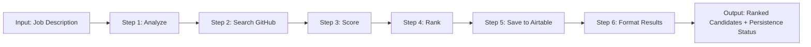

# 🎯 IntelligentHuntingWorkflow - Documentação Atualizada

## 📋 Overview

Workflow de hunting e recrutamento automatizado que analisa descrições de vagas, busca candidatos em plataformas públicas, calcula scores de compatibilidade, **persiste no Airtable** e retorna um ranking estruturado.

**⚡ Atualização**: Agora com persistência automática no Airtable!

---

## ✅ O que foi criado

### 🤖 **3 Agentes Especializados**

1. **JobDescriptionAnalyzer** (ID: `6aa5ccc3-f252-47e6-89d2-06827fc1549a`)

   - Extrai role, seniority, skills e keywords de descrições de vagas
   - Retorna JSON estruturado
   - Modelo: Claude Sonnet 4.5

2. **CandidateSearchAgent** (ID: `9e84a217-d9bc-42b4-8d8e-fce97115caa4`)

   - Busca candidatos em GitHub, Dev.to e Reddit
   - Tools: HTTP_GET
   - Retorna perfis normalizados

3. **CandidateScoringAgent** (ID: `6b6c476f-6cb8-4720-981c-7d539525021b`)

   - Calcula score 0-100 baseado em critérios objetivos
   - Fornece rationale detalhado
   - Modelo: Claude Sonnet 4.5

### 🔄 **Workflow com 6 Steps**

**Step 1: analyze-job-description**

- **Input**: `jobDescription` (string)
- **Output**: `jobData` (object), `rawJobDescription` (string)
- **Função**: Usa AI_GENERATE_OBJECT para extrair:
  - `role`: Cargo da vaga
  - `seniority`: junior | mid | senior | lead
  - `must_have_skills`: Array de habilidades obrigatórias
  - `nice_to_have_skills`: Array de habilidades desejáveis
  - `keywords`: Termos para busca
  - `boolean_search`: String booleana para LinkedIn Recruiter

**Step 2: search-candidates-github**

- **Input**: `keywords`, `location` (optional), `limit`
- **Output**: `candidates` (array)
- **Função**: Busca candidatos no GitHub usando API pública
  - Usa GitHub Search API
  - Obtém detalhes de cada usuário (bio, repos, followers, location)
  - Retorna perfis normalizados

**Step 3: score-candidates**

- **Input**: `candidates`, `jobData`
- **Output**: `scoredCandidates`, `jobData`
- **Função**: Calcula score de compatibilidade para cada candidato
  - Usa AI_GENERATE_OBJECT com schema de scoring
  - Critérios:
    - 40 pts: Compatibilidade de cargo
    - 30 pts: Match de skills e keywords
    - 20 pts: Compatibilidade de senioridade
    - 10 pts: Sinais de qualidade (inglês, comunicação, open source)

**Step 4: rank-candidates**

- **Input**: `scoredCandidates`, `jobData`, `topCandidatesCount`
- **Output**: `topCandidates`, `allRankedCandidates`, `jobData`, `summary`
- **Função**: Ordena candidatos por score e gera estatísticas
  - Ordenação decrescente por score
  - Seleciona top N candidatos (default: 5)
  - Calcula métricas: total, média, highest score

**⭐ Step 5: save-to-airtable (NOVO)**

- **Input**: `topCandidates`, `jobData`
- **Output**: `savedRecords`, `successCount`, `failureCount`
- **Função**: Persiste candidatos no Airtable
  - Lê secrets: `AIRTABLE_TOKEN`, `AIRTABLE_BASE_ID`, `AIRTABLE_TABLE_NAME`
  - Faz POST na API oficial do Airtable
  - Usa formato `records` com campos:
    - `jobTitle`: Extraído do `role` da vaga
    - `name`: Nome do candidato
    - `platform`: Plataforma de origem (github, dev.to, etc.)
    - `profileUrl`: Link do perfil
    - `score`: Score de compatibilidade (0-100)
    - `rationale`: Justificativa detalhada do score
  - Retorna contadores de sucesso/falha

**Step 6: format-results**

- **Input**: `topCandidates`, `jobData`, `summary`, `airtableResult`
- **Output**: `job`, `candidates`, `summary`, `persistence`
- **Função**: Formata output final estruturado
  - Adiciona seção `persistence` com resultados do Airtable
  - Inclui contadores: `saved`, `failed`, `error`

---

## 🔐 Configuração de Secrets

Antes de executar o workflow, configure os seguintes secrets:

### 1. **AIRTABLE_TOKEN**

- **Descrição**: Personal Access Token do Airtable
- **Como obter**:
  1. Acesse https://airtable.com/create/tokens
  2. Clique em "Create new token"
  3. Dê permissões de `data.records:write` para a base desejada
  4. Copie o token gerado

### 2. **AIRTABLE_BASE_ID**

- **Descrição**: ID da Base do Airtable
- **Como obter**:
  1. Acesse sua base no Airtable
  2. Olhe na URL: `https://airtable.com/appXXXXXXXXXXXXXX/...`
  3. Copie o ID que começa com `app...`

### 3. **AIRTABLE_TABLE_NAME**

- **Descrição**: Nome da tabela onde os candidatos serão salvos
- **Exemplo**: `Candidates`, `Recruitment Pipeline`, `Job Applicants`
- **Importante**: A tabela deve ter os seguintes campos:
  - `jobTitle` (Single line text)
  - `name` (Single line text)
  - `platform` (Single line text)
  - `profileUrl` (URL)
  - `score` (Number)
  - `rationale` (Long text)

### Como configurar os secrets:

```bash
# Via CLI
deco secret create AIRTABLE_TOKEN "seu_token_aqui"
deco secret create AIRTABLE_BASE_ID "appXXXXXXXXXXXXXX"
deco secret create AIRTABLE_TABLE_NAME "Candidates"
```

Ou use a interface do deco.cx para criar os secrets.

---

## 🚀 Como Usar

### Input do Workflow

```json
{
  "jobDescription": "Estamos buscando um Senior Backend Developer com experiência em Python, Django e APIs REST. O candidato deve ter 5+ anos de experiência...",
  "location": "Brazil",
  "candidateLimit": 10,
  "topCandidatesCount": 5
}
```

### Parâmetros

- **jobDescription** (required): Descrição completa da vaga em texto natural
- **location** (optional): Localização para filtrar candidatos
- **candidateLimit** (optional): Número máximo de candidatos a buscar (default: 10, max: 10)
- **topCandidatesCount** (optional): Número de top candidatos a retornar (default: 5)

### Output do Workflow

```json
{
  "job": {
    "role": "Senior Backend Developer",
    "seniority": "senior",
    "analyzed_at": "2025-12-15T23:18:00.000Z"
  },
  "candidates": [
    {
      "name": "João Silva",
      "platform": "github",
      "profile_url": "https://github.com/joaosilva",
      "score": 85,
      "rationale": "Forte experiência em Python e Django (40 pts). Match de 80%+ das skills obrigatórias (30 pts). Senioridade compatível baseado em 6 anos de experiência (20 pts). Projetos open source relevantes (10 pts)."
    }
  ],
  "summary": {
    "totalCandidates": 10,
    "topCandidatesCount": 5,
    "averageScore": 67.5,
    "highestScore": 85
  },
  "persistence": {
    "airtable": {
      "saved": 5,
      "failed": 0,
      "error": null
    }
  }
}
```

---

## 📊 Fluxo Completo



### Dados que fluem entre steps:

1. **analyze-job-description** → `jobData`, `rawJobDescription`
2. **search-candidates-github** → `candidates[]`
3. **score-candidates** → `scoredCandidates[]`
4. **rank-candidates** → `topCandidates[]`, `allRankedCandidates[]`, `summary`
5. **save-to-airtable** → `savedRecords[]`, `successCount`, `failureCount`
6. **format-results** → Output final estruturado

---

## 🔧 Exemplo de Tabela Airtable

### Schema Recomendado

| Campo | Tipo | Descrição |
| --- | --- | --- |
| **jobTitle** | Single line text | Título da vaga (ex: "Senior Backend Developer") |
| **name** | Single line text | Nome do candidato |
| **platform** | Single select | Plataforma de origem (github, dev.to, reddit) |
| **profileUrl** | URL | Link para o perfil do candidato |
| **score** | Number | Score de compatibilidade (0-100) |
| **rationale** | Long text | Justificativa detalhada do score |
| **createdAt** | Created time | Timestamp automático |
| **status** | Single select | Status manual (New, Contacted, Interview, etc.) |

### Views Recomendadas

1. **Top Candidates**: Filtro `score >= 70`, ordenado por `score DESC`
2. **By Platform**: Agrupado por `platform`
3. **By Job**: Agrupado por `jobTitle`
4. **Pipeline**: Kanban por `status`

---

## 🛠️ Extensões Futuras

### ✏️ Roadmap

1. **Mais Plataformas de Busca**

   - Dev.to (artigos e autores)
   - Reddit (subreddits de tecnologia)
   - Stack Overflow (perfis públicos)
   - Twitter/X (desenvolvedores ativos)

2. **Persistência Adicional**

   - ✅ Airtable (implementado)
   - Notion Database
   - Google Sheets
   - PostgreSQL via Supabase

3. **Análises Avançadas**

   - Sentiment analysis de posts/commits
   - Culture fit scoring
   - Detecção de soft skills
   - Análise de trajetória de carreira

4. **Automações**

   - Envio automático de convites (LinkedIn via human-in-the-loop)
   - Email outreach personalizado
   - Agendamento de entrevistas
   - Atualização de status no Airtable

5. **Dashboards e Views**

   - View customizada para visualizar candidatos
   - Gráficos de score distribution
   - Timeline de busca
   - Heatmap de skills

---

## 🔑 Regras de Scoring

### 1. Compatibilidade de Cargo (40 pontos)

- 40 pts: Cargo mencionado explicitamente no perfil
- 25 pts: Cargo relacionado (ex: Full Stack para vaga Backend)
- 10 pts: Cargo distante mas com skills relevantes
- 0 pts: Cargo incompatível

### 2. Match de Skills e Keywords (30 pontos)

- 30 pts: 80%+ das must_have_skills presentes
- 20 pts: 50-79% das must_have_skills presentes
- 10 pts: &lt;50% das must_have_skills presentes
- +5 pts bonus: nice_to_have_skills presentes

### 3. Compatibilidade de Senioridade (20 pontos)

- 20 pts: Senioridade exata (senior = senior)
- 15 pts: 1 nível de diferença (mid para senior)
- 5 pts: 2+ níveis de diferença
- Sinais: anos de experiência, complexidade de projetos

### 4. Sinais de Qualidade (10 pontos)

- +3 pts: Inglês fluente/técnico aparente
- +3 pts: Comunicação ativa (artigos, posts, comunidade)
- +4 pts: Projetos open source ou contribuições relevantes

---

## 💡 Observações Importantes

### ✅ Diferenciais

- **Apenas dados públicos**: Respeita privacidade e ToS das plataformas
- **Scoring objetivo e explicado**: Rationale detalha cada pontuação
- **Persistência automática**: Candidatos salvos no Airtable automaticamente
- **Facilmente extensível**: Adicionar novas plataformas é simples
- **Human-in-the-loop**: LinkedIn requer interação manual (boolean search gerada)

### ⚠️ Limitações Atuais

- GitHub API tem rate limiting (60 requests/hora sem auth)
- Busca limitada a 10 candidatos por execução
- Scoring depende da qualidade das bios/perfis públicos
- Airtable API tem limite de 10 registros por request (workflow divide automaticamente se necessário)

### 🔐 Segurança e Compliance

- Usa apenas APIs públicas e dados disponíveis
- Não scraping ou violação de ToS
- Respeita LGPD/GDPR (dados públicos)
- Secrets gerenciados de forma segura via Project Secrets Management

---

## 🐛 Troubleshooting

### Erro: "Missing Airtable credentials"

**Solução**: Configure os 3 secrets necessários (AIRTABLE_TOKEN, AIRTABLE_BASE_ID, AIRTABLE_TABLE_NAME)

### Erro: "Airtable API error: 422"

**Causa**: Schema da tabela não corresponde aos campos enviados **Solução**: Certifique-se de que a tabela tem os campos: jobTitle, name, platform, profileUrl, score, rationale

### Erro: "Airtable API error: 401"

**Causa**: Token inválido ou sem permissões **Solução**: Regenere o token no Airtable e certifique-se de dar permissão `data.records:write`

### Scoring retornando 0 para todos

**Causa**: Perfis do GitHub com pouca informação **Solução**: Ajuste os critérios de scoring ou adicione mais plataformas de busca

---

## 📚 Recursos Criados

- **URI do Workflow**: `rsc://i:workflows-management/workflow/IntelligentHuntingWorkflow`
- **3 Agentes**: JobDescriptionAnalyzer, CandidateSearchAgent, CandidateScoringAgent
- **6 Steps**: analyze → search → score → rank → **save-to-airtable** → format
- **Integrações Usadas**: AI Gateway, HTTP, Secrets Management, Time
- **3 Secrets**: AIRTABLE_TOKEN, AIRTABLE_BASE_ID, AIRTABLE_TABLE_NAME

---

## 📝 Changelog

### v2.0 - 15/12/2025

- ✨ **NOVO**: Step `save-to-airtable` para persistência automática
- ✨ **NOVO**: Gerenciamento de secrets para credenciais do Airtable
- 🔄 **ATUALIZADO**: Step `format-results` agora inclui seção `persistence`
- 📝 **DOCS**: Documentação completa de configuração do Airtable

### v1.0 - 15/12/2025

- ✨ Workflow inicial com 5 steps
- ✨ Busca no GitHub
- ✨ Scoring baseado em IA
- ✨ Ranking automático

---

**Criado em**: 15/12/2025\
**Última atualização**: 15/12/2025\
**Status**: ✅ Workflow pronto para uso com persistência no Airtable\
**Próximos passos**: Configurar secrets, testar com vaga real, adicionar mais plataformas
